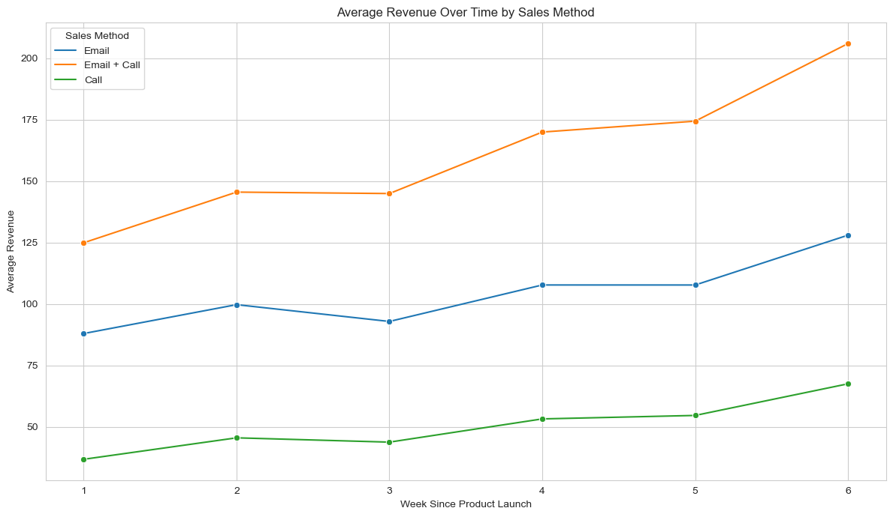
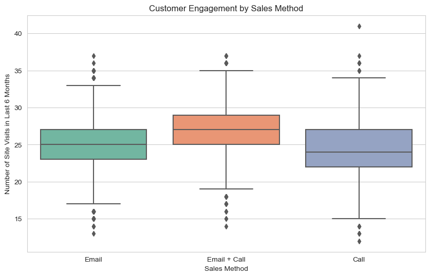

# Sales Method Analysis Project

[](https://github.com/ilazan/sales-method-analysis/blob/main/LICENSE)

## Description

This project analyzes various sales methods (Email, Call, and a combination of Email + Call) to determine the most effective approach for maximizing customer engagement and revenue. Using six weeks of post-product launch data, the project evaluates key metrics such as revenue trends, customer loyalty, and engagement.

### Objectives:
- Identify the most effective sales method.
- Provide actionable insights to improve sales strategies.
- Establish a sustainable approach for long-term success in a competitive market.

## Project Details

### Data Overview
- **Time Frame:** 6 weeks post-product launch.
- **Data Points:** Sales methods, revenue generated, customer engagement metrics (site visits, years as a customer).

### Methodology
1. **Data Cleaning:** Initial data processing to handle missing values and outliers.
2. **Exploratory Data Analysis (EDA):** Visualization and statistical analysis to identify patterns and trends.
3. **Revenue Analysis:** Detailed examination of revenue distribution across different sales methods.
4. **Customer Loyalty & Engagement:** Analysis of customer behavior metrics to gauge the effectiveness of each sales method.
5. **ARPA Calculation:** Average Revenue Per Account analysis to determine financial efficiency.

### Key Findings
- **Revenue Trends:** The Email + Call strategy showed the highest median revenue and an increasing trend over time.
- **Customer Engagement:** Higher site visits were observed in the Email + Call group, indicating strong engagement.
- **ARPA:** The Email + Call method had the highest ARPA, suggesting it is the most financially effective approach.

### Recommendations
- **Prioritize the Email + Call strategy** to leverage its high ARPA and effectiveness in customer engagement.
- **Continuous Monitoring:** Implement real-time tracking of key metrics to stay aligned with strategic goals.
- **Further Analysis:** Conduct deeper research into customer preferences to refine and personalize sales approaches.

## Installation

To replicate the analysis:

1. Clone the repository:
    ```bash
    git clone https://github.com/ilazan/sales-method-analysis.git
    ```
2. Navigate to the project directory:
    ```bash
    cd sales-method-analysis
    ```
3. Install the necessary dependencies:
    ```bash
    pip install -r requirements.txt
    ```

## Usage

### Running the Analysis

1. Open the Jupyter notebook `product_sales.ipynb`:
    ```bash
    jupyter notebook product_sales.ipynb
    ```
2. Run the cells to perform the analysis. The notebook includes code and explanations for each step of the process.

### Viewing the Presentation

The final presentation slides, which summarize the findings, are available in the PDF file:
- [Datacamp Certificate.pdf](./Datacamp%20Certificate.pdf)

### Example Output

Here are some key visualizations from the analysis:

#### Revenue Trends


The Email + Call method shows a significant increase in revenue over time, as illustrated in the chart above.

#### Customer Engagement


Higher site visits were observed in the Email + Call group, indicating better customer engagement.

## Contributing

We welcome contributions to enhance this project. Please follow these steps:

1. Fork this repository.
2. Create a new branch (`git checkout -b feature-branch`).
3. Make your changes and commit them (`git commit -am 'Add new feature'`).
4. Push to your branch (`git push origin feature-branch`).
5. Submit a Pull Request.

## License

This project is licensed under the MIT License - see the [LICENSE](LICENSE) file for details.

## Acknowledgments

- Special thanks to [DataCamp](https://www.datacamp.com) for the platform and resources.
- Inspired by contributions from the open-source data science community.
